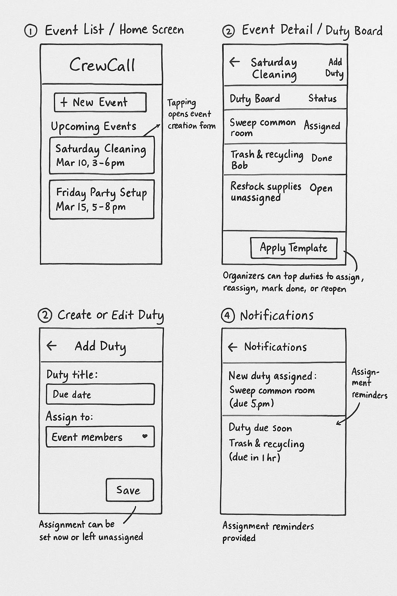

# Assignment 2: Functional Design


## Problem Statement

### Problem Domain — Group Duty Management
Student groups, fraternities, and clubs regularly need to assign and track duties for chores, parties, and other group activities. I help organize MIT fraternity events and house chores and have seen how hard it is to keep track of who is responsible for setup, cleanup, and ongoing tasks when everything is spread across group chats or informal notes. Good coordination keeps events smooth and shared spaces clean, but poor coordination causes confusion, uneven workloads, and last-minute scrambling.

### Key Problem — Role and Duty Assignment
When planning a party or setting up regular chores, organizers must make sure all roles are filled, that work is balanced, and that everyone knows their responsibilities. Right now, this is often managed with ad hoc spreadsheets and text threads. Tasks are forgotten, people are double-booked, and updates are hard to communicate. The issue is not missing features in an existing tool, but the lack of one simple place where organizers can clearly assign and track duties with fixed teams of participants.

### Stakeholders
The main stakeholder is the **organizer**, who creates the plan and assigns duties. **Duty members** (those assigned to setup, cleanup, or other roles) depend on clear, timely assignments so they know what to do and when. **Attendees** benefit indirectly from smooth organization and clean spaces because duties are reliably handled.

### Evidence and Comparables
There is strong evidence that this problem is real. Studies show that around 90 % of operational spreadsheets contain errors, with 0.8 %–1.8 % formula mistakes, and only about 13 % of spreadsheets are ever audited, meaning hidden problems go undetected. From personal experience in MIT fraternity planning, we often scramble on event day to fill forgotten roles or redo chore schedules because plans live in Slack threads and scattered files. Broader reports from student and community organizers highlight “coordination across tools” and “missed assignments” as major pain points.

Existing tools don’t fully solve this. Google Sheets and Excel are flexible but manual and error-prone. Trello and Asana work for general task tracking but are too heavy for small group chores and parties. SignUpGenius is built for volunteers but lacks integrated recurring duty assignment and easy reuse of fixed teams. Notion can be customized but requires heavy setup and lacks lightweight duty-management features.

## Application Pitch

### Name
**CrewCall** – a simple, central hub for assigning and tracking group duties.

### Motivation
When duties for events or house chores are spread across group chats or messy spreadsheets, people forget tasks, workloads become uneven, and organizers spend hours chasing confirmations. CrewCall brings everything into one place so organizers can assign roles quickly and everyone knows their duties.

### Key Features
**1. Duty Board**  
A single board where organizers create duties (setup, cleanup, monitoring), assign them to specific members, and set deadlines. This keeps all roles visible, prevents forgotten jobs, and ensures balanced workloads.

**2. Reusable Duty Groups**  
Organizers can define fixed teams or rotations (e.g., weekly house chores or recurring party roles) and quickly reassign the same structure to new events. This saves time and reduces repetitive planning.

**3. Timely Reminders**  
CrewCall automatically notifies members when their duties are assigned or when deadlines approach. This ensures everyone is on time and reduces last-minute stress for organizers and participants.

Together these features replace scattered spreadsheets and chats with a focused system for creating, assigning, and tracking duties—keeping events smooth and shared spaces well managed.

## Concept Design

### Concepts
**1. EventDirectory [User, Event]**  
Purpose: Define events (or recurring chore periods) and maintain membership and roles such as Organizer or DutyMember.  
Principle: Organizers create events and set which users are part of the duty roster.  
State:  
- Events with `id: Event`, `title: String`, `startsAt: Time`, `endsAt: Time`, `active: Flag`  
- Memberships with `event: Event`, `user: User`, `role: Enum{Organizer, DutyMember}`  
Actions:  
- `createEvent(creator: User, title: String, startsAt: Time, endsAt: Time)`  
- `invite(event: Event, inviter: User, invitee: User, role: Role)`  
- `setActive(event: Event, setter: User, flag: Flag)`

**2. DutyRoster [User, Event]**  
Purpose: Represent all duties and assignments.  
Principle: Duties are created for an event and assigned to users; they move through Open → Assigned → Done.  
State:  
- Duties with `event: Event`, `title: String`, `dueAt: Time`, `status: Enum{Open, Assigned, Done}`, `assignee: User?`  
Actions:  
- `addDuty(event: Event, actor: User, title: String, dueAt: Time)`  
- `assignDuty(duty: Duty, actor: User, assignee: User)`  
- `markDone(duty: Duty, actor: User)`  
- `reOpen(duty: Duty, actor: User)`

**3. RotationGroups [User, Event]**  
Purpose: Save reusable groups of members and standard duties for easy reapplication.  
Principle: An organizer defines a template of roles and members; it can be applied to new events.  
State:  
- Templates with `title: String`, `members: Set<User>`, `standardDuties: Set<String>`  
Actions:  
- `createTemplate(owner: User, title: String, members: Set<User>, standardDuties: Set<String>)`  
- `applyTemplate(template: Template, event: Event, actor: User)`

**4. Notify [User]**  
Purpose: Deliver notifications when duties are assigned or due soon.  
Principle: Other concepts trigger notifications to affected users.  

State:  
- Notifications with `recipient: User`, `subject: String`, `body: String`, `createdAt: Time`, `unread: Flag`

Actions:  
- `notify(recipient: User, subject: String, body: String)`  
- `markRead(notification: Notification, user: User)`

**5. Sync — Assignment Notification**
```
when Duty d with d.status = Assigned
where (u = d.assignee)
then notify(u, "New duty assigned", d.title + " due " + d.dueAt).
```

**6. Sync — Due Soon Reminder**
```
when Duty d with d.status = Assigned and now + 24h >= d.dueAt
where (u = d.assignee)
then notify(u, "Duty due soon", d.title + " is due by " + d.dueAt).
```

**7. Sync — Template Application**
```
when Template t is applied to Event e
where (u in t.members)
then addDuty(e, actor, dutyName, dueAt) for each dutyName in t.standardDuties.
```

### Integration Note

- **Separation of concerns**  
  - *EventDirectory* defines events and maintains membership and roles. Other concepts only depend on event IDs and membership, without knowing internal event details.  
  - *DutyRoster* manages the lifecycle of each duty (Open → Assigned → Done). It doesn’t know about templates or notifications; it just exposes state that syncs use.  
  - *RotationGroups* captures reusable groups and standard duties. Applying a template adds duties to an event via syncs, not by embedding logic inside other concepts.  
  - *Notify* is a separate messaging concept. Other concepts never send notifications directly—they only trigger syncs that call Notify.

- **Mapping features to concepts**  
  - **Duty Board** = EventDirectory (permissions and membership) + DutyRoster (task creation and updates) + Notify (assignment and due reminders).  
  - **Reusable Duty Groups** = RotationGroups (templates) + DutyRoster (instantiated duties).  
  - **Timely Reminders** = DutyRoster (due dates) + Notify (delivery) via syncs.

- **Generic type bindings**  
  - `User` = the app’s registered account type, shared across all concepts.  
  - `Event` = event identifiers created by EventDirectory and referenced by DutyRoster and RotationGroups.  
  - Other fields (`title`, `dueAt`, etc.) are simple types and don’t assume any structure beyond their definitions.

## UI Sketches


## User Journey

**Trigger — weekly chore planning**  
Jacob, the house manager for an MIT fraternity, is responsible for organizing weekly cleaning and trash duties. In the past, he rotated names manually in a spreadsheet, but people often forgot their assignments or swapped informally, leaving some tasks undone. This week he decides to manage the schedule using **CrewCall**.

**Step 1 — create the weekly event**  
From the **Event List screen** (top-left sketch), Jacob taps **“New Event”**, names it *Week of Oct 7 – House Chores*, and sets the start and end dates for the week. All house members are already stored as users, so he simply selects the fixed membership list and marks himself as **Organizer**.

**Step 2 — apply a saved rotation group**  
Because these chores repeat every week, Jacob opens the **RotationGroups** tab (bottom-left sketch) and applies the template *Weekly Cleaning Rotation*. This template already lists standard duties—*Kitchen clean-up*, *Bathroom scrub*, *Trash & recycling*, and *Common room vacuum*—and a predefined rotation of members.

**Step 3 — adjust and confirm duties**  
The template automatically fills the **Duty Board** (top-right sketch) with this week’s assignments and due times, rotating members so everyone shares the workload fairly. Jacob checks the list, makes one quick edit (swapping two members who are away), and saves.

**Step 4 — automatic notifications and reminders**  
Immediately after saving, each member receives a **CrewCall** notification generated by the **Notify** concept, telling them which duty and due time they have. Twenty-four hours before each task is due, CrewCall sends a reminder so no one forgets.

**Outcome — balanced and reliable chores**  
Throughout the week, members mark their tasks complete from their phones (bottom-right sketch). Jacob sees real-time updates on the Duty Board and doesn’t need to send nagging messages or maintain a spreadsheet. By Sunday evening the kitchen, bathrooms, and common rooms are all clean, and CrewCall has ensured a fair, rotating distribution of work without last-minute scrambling.
