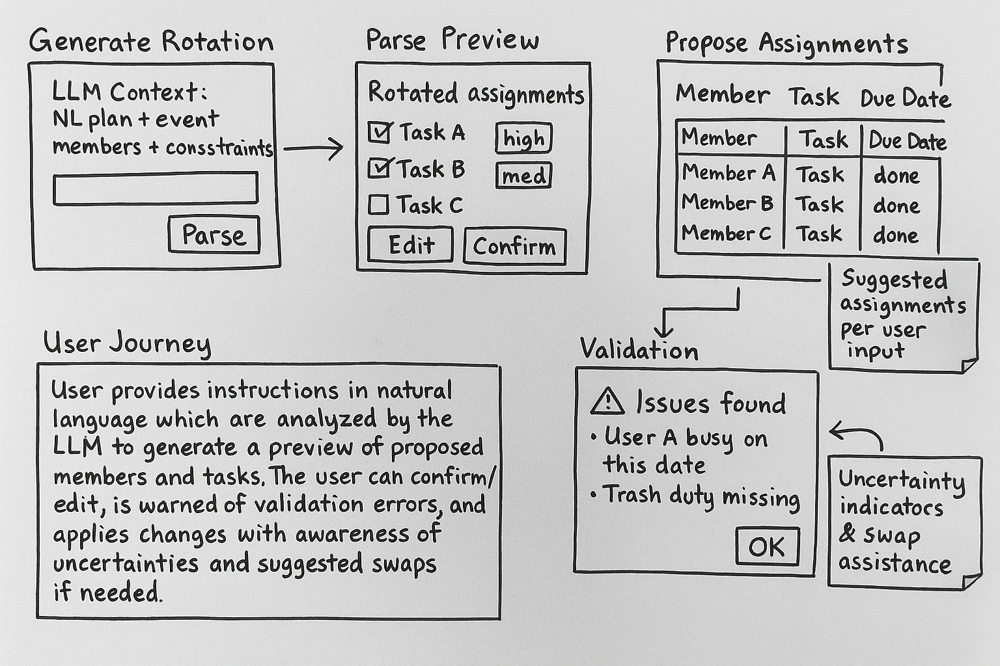

# Assignment 3

## 1. AI Augmented Concept

### Original Concept

#### 1.1 EventDirectory [User, Event]
**Purpose.** Define events (or recurring chore periods) and maintain membership and roles such as Organizer or DutyMember.

**State.**
- `Events`: { id: Event, title: String, startsAt: Time, endsAt: Time, active: Flag }
- `Memberships`: { event: Event, user: User, role: Enum{Organizer, DutyMember} }

**Actions.**
- `createEvent(creator: User, title: String, startsAt: Time, endsAt: Time)`
- `invite(event: Event, inviter: User, invitee: User, role: Role)`
- `setActive(event: Event, setter: User, flag: Flag)`

#### 1.2 DutyRoster [User, Event]
**Purpose.** Represent all duties and assignments. Duties move through Open → Assigned → Done.

**State.**
- `Duties`: { id: Duty, event: Event, title: String, dueAt: Time, status: Enum{Open, Assigned, Done}, assignee: User? }

**Actions.**
- `addDuty(event: Event, actor: User, title: String, dueAt: Time)`
- `assignDuty(duty: Duty, actor: User, assignee: User)`
- `markDone(duty: Duty, actor: User)`
- `reOpen(duty: Duty, actor: User)`

#### 1.3 RotationGroups [User, Event]
**Purpose.** Save reusable groups of members and standard duties for easy reapplication.

**State.**
- `Templates`: { id: Template, title: String, members: Set<User>, standardDuties: Set<String> }

**Actions.**
- `createTemplate(owner: User, title: String, members: Set<User>, standardDuties: Set<String>)`
- `applyTemplate(template: Template, event: Event, actor: User)`

#### 1.4 Notify [User]
**Purpose.** Deliver notifications when duties are assigned or due soon.

**State.**
- `Notifications`: { id: Notification, recipient: User, subject: String, body: String, createdAt: Time, unread: Flag }

**Actions.**
- `notify(recipient: User, subject: String, body: String)`
- `markRead(notification: Notification, user: User)`

#### 1.5 Syncs (original)
- **Assignment Notification:** when `Duty d` with `d.status = Assigned`, where `u = d.assignee`, then `notify(u, "New duty assigned", d.title + " due " + d.dueAt)`.
- **Due Soon Reminder:** when `Duty d` with `d.status = Assigned` and `now + 24h ≥ d.dueAt`, where `u = d.assignee`, then `notify(u, "Duty due soon", d.title + " is due by " + d.dueAt)`.
- **Template Application:** when `Template t` is applied to `Event e`, where `(u ∈ t.members)`, then `addDuty(e, actor, dutyName, dueAt)` for each `dutyName ∈ t.standardDuties`.

---

### AI Augmented Concept

*(Adds AI‑powered intake, drafting, explanation, and validation while preserving all original behavior.)*

#### 2.1 Extended/New State
- `AssignmentDraft`: {
  id: Draft,
  event: Event,
  proposedAt: Time,
  proposedBy: User | System("LLM"),
  rationale: String,                  // human‑readable explanation from LLM
  objective: Enum{Fairness, MinConflicts, MinFatigue, Custom},
  constraints: Json,                  // availability, max per person, disallowed pairs, history
  assignments: Set<{ duty: DutyRef | {title, dueAt}, assignee: User }>,
  confidence: Float in [0,1],
  model: String,                      // e.g., gpt‑4o‑mini, o3, etc.
  promptHash: String                  // for audit/repro
}

- `DutyParseLog`: {
  id: ParseLog,
  event: Event,
  inputText: String,                  // user’s natural‑language plan
  parsedDuties: Set<{ title, dueAt?, duration?, location? }>,
  parserNotes: String,
  confidence: Float,
  model: String,
  createdAt: Time
}

#### 2.2 New/Extended Actions (Requires/Effects)
**A) Natural‑Language Duty Intake**
- `parseDutyPlan(event: Event, actor: User, nlPlan: String) -> ParseLog`
  - **Requires:** `actor` is Organizer for `event`.
  - **Effect:** Calls LLM to transform `nlPlan` into structured duties; persists `DutyParseLog`.

- `instantiateParsedDuties(parseLog: ParseLog, actor: User) -> Set<Duty>`
  - **Requires:** Organizer.
  - **Effect:** Creates `Duty` rows for each entry in `parseLog.parsedDuties` via `addDuty`.

**B) AI Assignment Drafting**
- `proposeAssignments(event: Event, actor: User, objective: Objective, constraints?: Json) -> AssignmentDraft`
  - **Requires:** Organizer; event has duties & members.
  - **Effect:** Calls LLM to produce a proposed mapping duties→assignees with `rationale` and `confidence`; stores `AssignmentDraft`.

- `explainAssignment(draft: Draft, requester: User) -> String`
  - **Effect:** Returns LLM‑generated explanation (fairness math, conflicts avoided, tie‑breakers) for transparency.

- `validateDraft(draft: Draft) -> { ok: Bool, violations: Set<String> }`
  - **Effect:** Deterministic validator (non‑LLM). Checks membership, duplicates, max‑load, time conflicts.

- `applyDraft(draft: Draft, actor: User) -> Set<Duty>`
  - **Requires:** Organizer; `validateDraft(draft).ok` is true.
  - **Effect:** Executes `assignDuty` per draft; triggers existing Notify syncs.

**C) Optional Swap‑Assist**
- `suggestSwap(event: Event, requester: User, duty: Duty, reason: String) -> Set<{counterparty: User, swapWith: Duty, message: String}>`
  - **Effect:** LLM suggests fair swaps (same workload/time window); organizer approves; then `assignDuty` edits.

#### 2.3 Operational Principles
1. **Human‑in‑the‑loop:** AI proposes; organizers confirm (`instantiateParsedDuties`, `applyDraft`).
2. **Deterministic validation before side‑effects:** `validateDraft` must pass before assignments change.
3. **Auditability:** Store `promptHash`, `model`, `confidence`, `rationale` with each draft; enable rollback and review.
4. **Privacy & Minimality:** Avoid unnecessary PII in prompts; prefer stable member IDs.
5. **Graceful Degradation:** Original manual actions remain fully usable without AI.

#### 2.4 Syncs (Extended)
- **On Draft Applied:** For each assigned duty, fire the original **Assignment Notification** sync.
- **On ParseLog Instantiated:** Newly created duties become eligible for the original **Due Soon Reminder**.

## 2. UX Sketches and Journey

